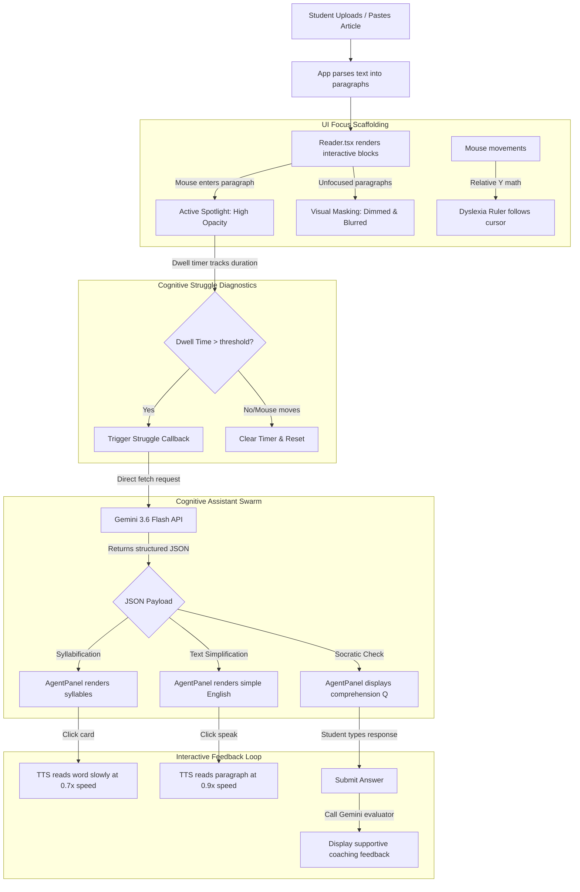

# DyslexiFlow Lite ⚡

An intelligent, gaze-simulated adaptive reading companion designed to alleviate cognitive fatigue, visual distraction, and decoding difficulties for neurodivergent K-12 students (Dyslexia, ADHD, and visual processing differences).

Built with **React, TypeScript, Tailwind CSS, Web Speech API**, and powered by **Google Gemini 3.6 Flash**.

---

## 📌 The Problem & The Solution

### The Challenge
For students with dyslexia and ADHD, reading traditional text blocks can cause:
* **Visual Crowding**: Words and letters appear to cluster or shift, causing line-skipping and reading fatigue.
* **Decoding Hurdles**: Multisyllabic words are difficult to break down phonetically on the fly.
* **Sensory Overload**: A full page of text creates visual density distractions.

### The DyslexiFlow Solution
DyslexiFlow Lite creates an interactive, distraction-free reading workspace:
1. **Visual Scaffolding**: Dims and blurs inactive text to isolate the active paragraph, keeping visual focus locked.
2. **Tactile Guide**: A hover-following, color-customizable reading ruler acts as a physical guide rail.
3. **Auditory Reinforcement**: TTS narration reads simplified text at highly clear, slightly slower speeds (`0.9x`), and parses complex syllables phonetically (at `0.7x` speed).
4. **Socratic AI Coaching**: Evaluates comprehension checks supportively, encouraging students to learn through feedback and guidance rather than static grades.

---

## 🏗️ System Architecture

DyslexiFlow Lite operates as a closed-loop client-side application. The visual layout spotlighting and focus ruler help reduce sensory distractions, while the background AI agent acts as a Socratic tutor during reading pauses.



---

## ⚡ Core Features

* **Active Paragraph Spotlight (Line Masking)**: Dimming non-focused text blocks prevents the ADHD/dyslexic brain from skipping lines and getting distracted by visual density.
* **Interactive Reading Ruler**: A translucent colored guideline that overlays text following the mouse, serving as a physical focus line to help scan paragraphs.
* **Struggle-Dwell Threshold**: If a reader is stuck on a paragraph, a background timer infers struggle, automatically triggering AI assistance.
* **Phonetic Decoding**: Splits complex vocabulary into colored syllable badges. Click-to-speak allows students to hear the correct phonetic enunciation slowly.
* **Encouraging Socratic Evaluation**: Instead of grading answers as right or wrong, the agent provides validating, positive commentary. If an answer is wrong, it kindly guides them and asks: *"Please read the paragraph again."*
* **TTS Options**: Selectable speech triggers to read either the **Original** complex text or the **Simplified** plain-English explanation.
* **Permanent Dark Mode**: Tailored for reduced eye strain and high readability contrast.

---

## 🛠️ Tech Stack

* **Frontend Framework**: React 19 + TypeScript + Vite.
* **Styling**: Tailwind CSS v4 (locked in a permanent, high-contrast dark theme).
* **LLM Core**: Google Gemini 3.6 Flash (utilizing client-side Google Gen AI SDK for sub-second latency).
* **Audio Engine**: Native Browser Web Speech Synthesis API (offline, zero-cost, zero latency).
* **Data Persistence**: `localStorage` (safely stores API key, typography sizes, and ruler preferences).

---

## 🚀 Quickstart

Ensure you have [Node.js](https://nodejs.org/) installed, then follow these steps:

### 1. Install dependencies
```bash
npm install
```

### 2. Configure Environment Key (Optional)
Create a `.env.local` file in the root directory:
```env
VITE_GEMINI_API_KEY=your_google_gemini_api_key_here
```
*(Alternatively, you can paste your API key directly into the settings modal inside the app).*

### 3. Run Development Server
```bash
npm run dev
```
Open [http://localhost:5173](http://localhost:5173) in your browser.

### 4. Build for Production
```bash
npm run build
```

---

## 👥 Hackathon Team Roles
* **Lead AI Architect**: Configured Generative AI prompts, structured JSON schemas, and Socratic evaluation pipelines.
* **UI Component Developer**: Programmed paragraph spotlight states, scroll height tracking, and the visual settings menu.
* **UX/UI & Styling Lead**: Standardized accessibility fonts, Tailwind theme configurations, and glassmorphic designs.
* **AI Integration & Audio Specialist**: Coded Speech Synthesis enunciation parameters, file readers, and coordinate controllers.
