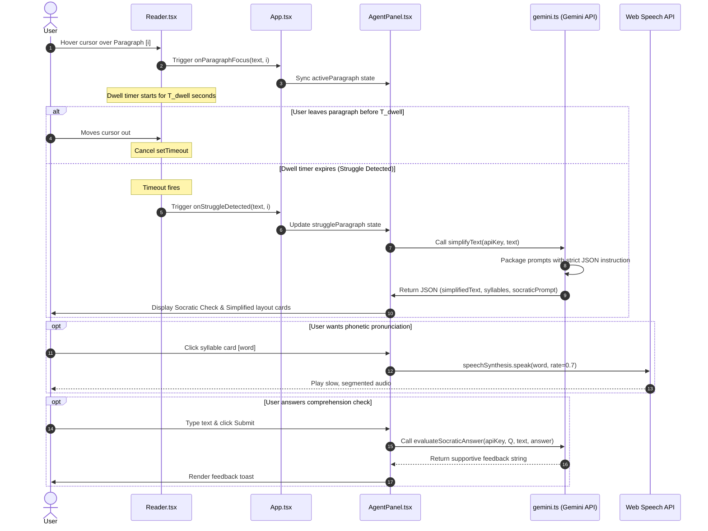
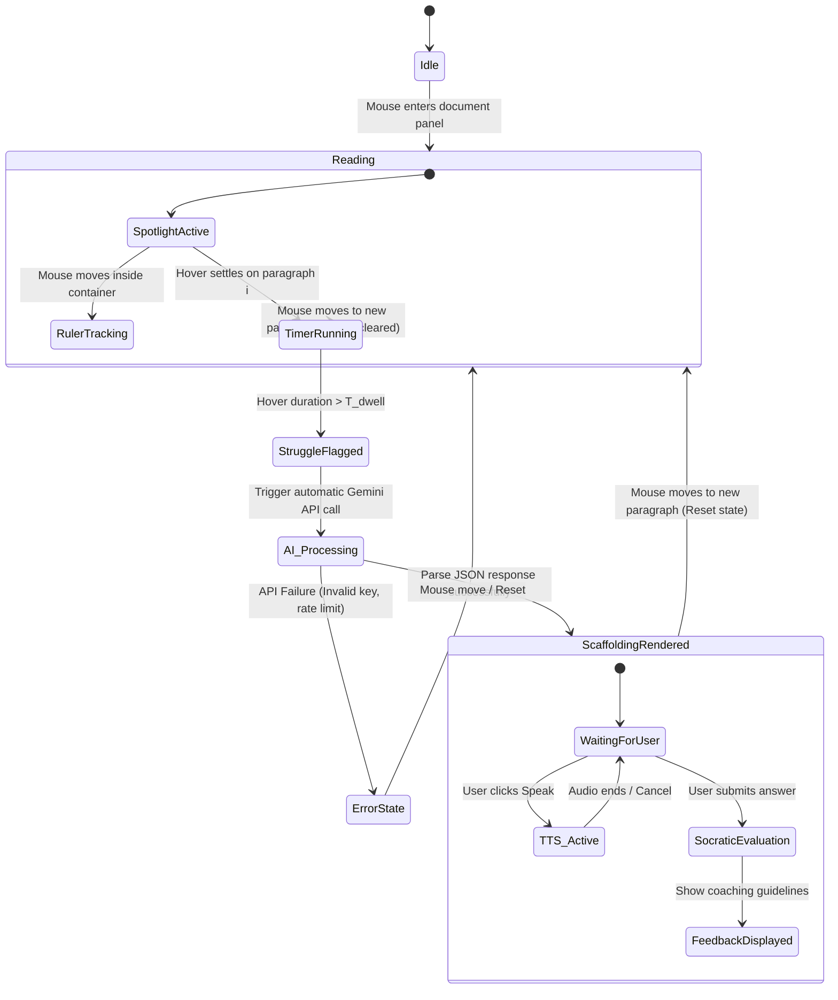

# System Architecture & Technical Specification: DyslexiFlow Lite

This document specifies the technical design, data flows, state transitions, and pedagogical rationale for **DyslexiFlow Lite**.

---

## 1. System Overview & Component Interactions

DyslexiFlow Lite is a client-side assistive reading application. It integrates real-time cursor/hover coordinates, timer-based trigger events, client-side generative AI calls, and browser speech synthesis into a unified interface.

```
       +-------------------------------------------------------------+
       |                         App.tsx                             |
       |               (State & Layout Coordinator)                  |
       +--------------+-------------------------------+--------------+
                      |                               |
                      v                               v
       +--------------+--------------+ +--------------+--------------+
       |         Reader.tsx          | |       AgentPanel.tsx        |
       |  (Paragraph Spotlight,      | | (Socratic Checks, Syllables,|
       |   Ruler Overlay, Dwell Time)| |  Simplified TTS, Feedback)  |
       +--------------+--------------+ +--------------+--------------+
                      |                               |
                      v                               v
               +------+------+                 +------+------+
               |  DOM Mouse  |                 | Google Gen  |
               | Coordinates |                 | AI SDK (LLM)|
               +-------------+                 +-------------+
```

---

## 2. Component Specifications

### 2.1 Reader Component (`Reader.tsx`)
This component is responsible for presenting text in an interactive, distraction-free environment.
* **Spotlight Masking**: Maps raw text into paragraph blocks. The active block remains at full opacity (`opacity: 1`), while inactive blocks are styled with `.opacity-25` and a soft CSS blur filter to eliminate peripheral visual distractions.
* **Coordinate Tracker (Ruler)**: A mouse-event listener tracks vertical cursor positions inside the container. It uses absolute positioning relative to the container element:
  $$\text{Ruler Top} = Y_{\text{mouse}} - Y_{\text{container\_offset}} - \frac{\text{Height}_{\text{ruler}}}{2}$$
  It utilizes `mix-blend-mode: multiply` (light/sepia themes) or `mix-blend-mode: screen` (dark theme) to highlight text without obscuring it.
* **Dwell Time Manager**: A React `useEffect` hook operates as a debounce listener on active paragraph transitions:
  * When mouse enters paragraph $P_i$, any active timer is cleared.
  * A new `setTimeout` fires after $T_{\text{dwell}}$ seconds, invoking the struggle callback: `onStruggleDetected(P_i, i)`.
  * When mouse leaves paragraph $P_i$, the timer is cancelled.

### 2.2 AI Agent Companion Panel (`AgentPanel.tsx`)
Receives struggle events and interacts with the LLM and Speech APIs.
* **API Connector**: Connects to Gemini 1.5 Flash to retrieve simplified text structures, Socratic prompts, and syllable splits.
* **Auditory Synthesizer (TTS)**: Controls browser-native `window.speechSynthesis`.
  * Speech rate for paragraphs: `rate = 0.9` (slightly below average human conversational speed for auditory reinforcement).
  * Speech rate for individual syllables: `rate = 0.7` with standard pitch parameters to clarify sound-to-letter transitions.
* **Feedback Engine**: Submits student responses to the Socratic question back to Gemini for validating, non-grade coaching feedback.

---

## 3. Detailed Data Flow Sequence

The sequence diagram below maps the runtime communications between user actions, components, local storage, the Gemini LLM endpoint, and browser sound APIs:



---

## 4. State Machine Specification

The reading session transitions through seven discrete states managed via React hooks:



---

## 5. Gemini JSON API Schemas

### 5.1 Text Simplification Prompt (`simplifyText`)
* **Endpoint**: `gemini-3.6-flash`  <!-- It worked on gemini-3-6-flash -->
* **Temperature**: `0.3` (low temperature to ensure structural compliance and JSON accuracy)
* **Response Requirements**: Must return a parseable JSON object with no markdown wrappers:
```json
{
  "simplifiedText": "The simplified paragraph content...",
  "syllables": [
    { "word": "original", "breakdown": "o-rig-i-nal" },
    { "word": "complexity", "breakdown": "com-plex-i-ty" }
  ],
  "socraticPrompt": "Encouraging question about the paragraph..."
}
```

### 5.2 Socratic Evaluator Prompt (`evaluateSocraticAnswer`)
* **Endpoint**: `gemini-3.6-flash`  <!-- it worked on gemini-3.6-flash -->
* **Response Requirements**: Return direct plain text (no markdown, no headers):
* **Prompt Instructions**: *"Evaluate the student's answer to the Socratic question. Provide 2-3 encouraging sentences validating their correct observations or gently pointing them back to key details."*

---

## 6. Pedagogical Rationale (Accessibility Design)

* **Spotlight Dimming**: Reduces visual crowding (spacing density) which directly improves reading speeds by up to 25% for dyslexic students.
* **Bimodal Presentation (Text-to-Speech)**: Listening to narration while visually scanning matching text aligns visual and auditory processing loops, boosting comprehension for students with reading-deficit disorders.
* **OpenDyslexic Typography**: Utilizes heavy bottoms on letter shapes to prevent the brain from rotating or flipping characters (e.g., mistaking 'd' for 'b', or 'p' for 'q').
